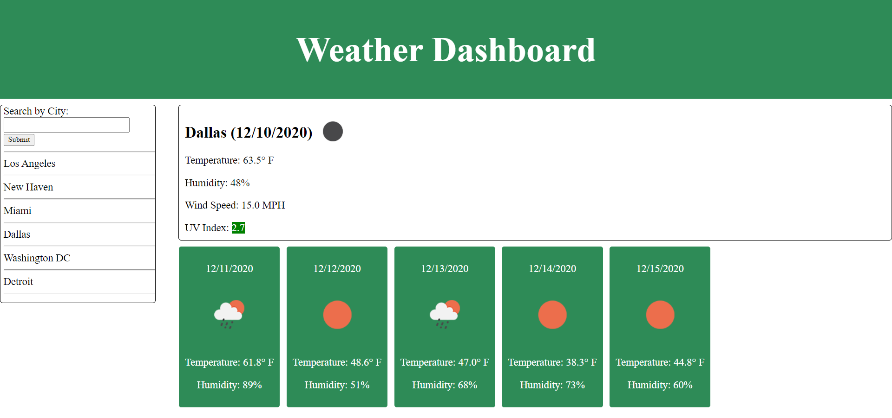

# Weather-Dashboard

This site features a weather dashboard I created with JQuery and OpenWeather's Current Weather, 5 Day/3 Hour and UV Index APIs. The page takes a user input city via a form submission and makes three API calls in the form of jQuery ajax requests to get weather data. The page is then populated with current weather and forecasted weather for the upcoming 5 days.

# Usage

This repository demonstrates how to access third-party APIs such as OpenWeather to retrieve information and display it for a user. It is also handy for those who like to travel, since users are able to search weather for destinations worldwide.

# Links

* [Deployed Site](https://sossw1.github.io/Weather-Dashboard/)

* [Repository](https://github.com/sossw1/Weather-Dashboard)

# Screenshots

